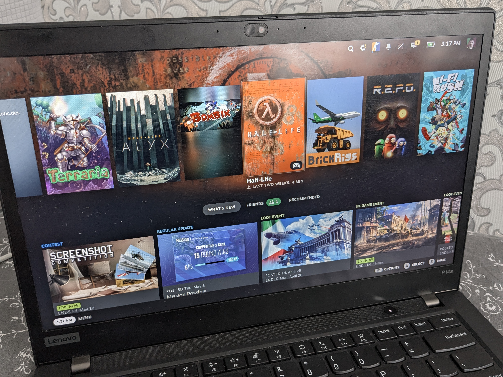

# add gamescope with steam to gdm on fedora



this guide explains how to add gamescope to the gdm on fedora to get steamdeck-like experience

### why?

- less input lag compared to gnome, because gamescope allow tearing, useful for online shooters like cs
- gamepad friendly ui

### install gamescope

for silverblue:

```sh
rpm-ostree install gamescope
```

for workstation:

```sh
sudo dnf install gamescope
```

### install steam

```sh
flatpak install flathub com.valvesoftware.Steam
```

### add session to gdm

```sh
echo '''
[Desktop Entry]
Name=gamescope
Comment=gamescope
Exec=gamescope --steam -- flatpak run com.valvesoftware.Steam -steamos3 -gamepadui -fulldesktopres
Type=Application
DesktopNames=gamescope
''' | sudo tee /usr/local/share/wayland-sessions/gamescope.desktop
```

now you can reboot and you will see a gamescope session in gdm

### bugs

- turn off system (black screen instead of turn off)
- restart system (black screen instead of restart)
- switch to desktop (nothing happens instead of switching to gnome)

if you know how to fix bugs please show me, i will add it to guide

### credits

https://discussion.fedoraproject.org/t/notes-from-building-a-steam-appliance-on-silverblue/35267

