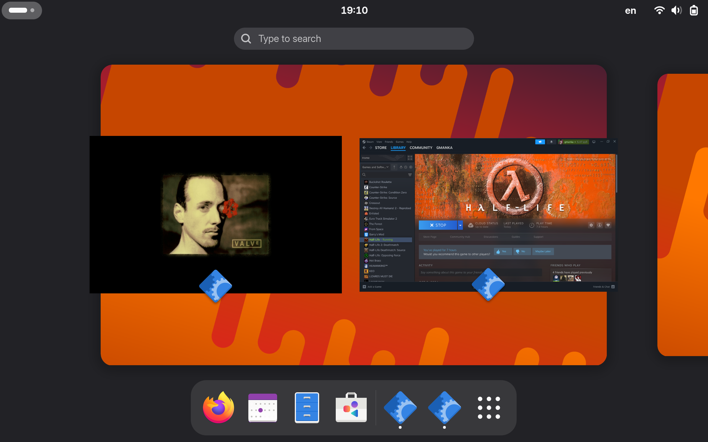
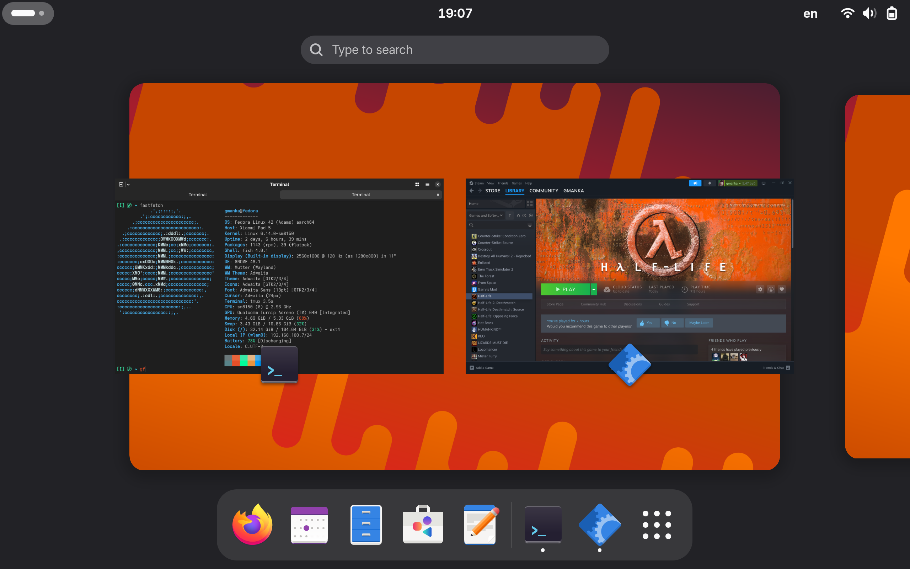

# running steam on fedora arm




tested on xiaomi pad 5 with [fedora 42](https://github.com/nik012003/nabu-fedora-builder/blob/main/install.md)

```sh
# delete muvm and qemu, because they prevent fex-emu from working correctly
sudo dnf remove @86-emulation muvm qemu-user qemu-user-static qemu-user-binfmt qemu-user-static-aarch64 qemu-user-static-arm qemu-user-static-x86
# muvm is a thing thant only required on apple silicon
# my device has a snapdragon cpu, so muvm should be deleted

sudo dnf install fex-emu fuse

echo 0 | sudo tee /proc/sys/fs/binfmt_misc/qemu*
echo 1 | sudo tee /proc/sys/fs/binfmt_misc/FEX*

mkdir ~/.config/systemd/user
echo '''
[Service]
ExecStart=FEXServer -f -p
''' | tee ~/.config/systemd/user/fexserver.service
systemctl --user daemon-reload
systemctl --user start fexserver
systemctl --user status fexserver
# ensure service is active

FEXInterpreter /usr/bin/uname -a
# Linux fedora 6.11.0 # SMP Feb 23 2025 00:00:00 x86_64 GNU/Linux
FEXBash -c 'uname -a'
# Linux fedora 6.11.0 # SMP Feb 23 2025 00:00:00 x86_64 GNU/Linux
# ensure both FEXInterpreter and FEXBash working

# download steam
mkdir -p ~/files/steam
cd ~/files/steam
curl -LO https://rpmfind.net/linux/rpmfusion/nonfree/fedora/releases/42/Everything/x86_64/os/Packages/s/steam-1.0.0.82-3.fc42.i686.rpm
rpm2cpio steam*.rpm | cpio -idmv

# run steam
FEXInterpreter ~/files/steam/usr/lib/steam/bin_steam.sh
```

